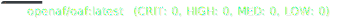
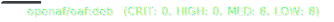
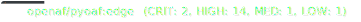

# OpenAF dockers

This repository hosts the Dockerfiles and helper scripts that produce the official OpenAF container images. They ship the OpenAF runtime, optional tooling, and pre-configured runtimes for common deployment scenarios.

## Security scan status

[](.github/sec-latest.md) <br/>
[](.github/sec-nightly.md) <br/>
[](.github/sec-edge.md)  <br/>
[](.github/sec-ubi-latest.md) <br/>
[](.github/sec-ubi-nightly.md) <br/>
[](.github/sec-deb-latest.md) <br/>
[](.github/sec-deb-nightly.md)  <br/>
[](.github/sec-oJobRT-latest.md) <br/>
[](.github/sec-oJobRT-nightly.md) <br/>
[](.github/sec-oJobRT-edge.md)  <br/>
[](.github/sec-pyOAF-nightly.md) <br/>
[](.github/sec-pyOAF-edge.md)<br/>

## Quick start

```sh
# Pull the latest stable OpenAF runtime
docker pull openaf/openaf:latest

# Start an interactive shell with OpenAF available on the PATH
docker run --rm -ti openaf/openaf:latest

# Run a script mounted from the host
docker run --rm -ti \
  -v "$PWD/scripts":/scripts \
  -e OPENAF=/scripts/example.js \
  openaf/openaf:latest
```

### Common entrypoint options

| Variable    | Purpose | Example |
|-------------|---------|---------|
| `OPACKS`    | Comma-separated list of oPacks to install on the first run (fetched from configured repositories). | `OPACKS=APIs,Docker,Mongo` |
| `OPACKS_DIR`| Folder inside the container containing `.opack` files or unpacked oPack directories to install on the first run. | `OPACKS_DIR=/opacks` |
| `OPACKS_DB` | Comma-separated list of remote oPack database URLs to add before installing oPacks. | `OPACKS_DB=https://my.repo/opack.db,https://mirror/opacks.json` |
| `OPENAF`    | Path to a script inside the container that should be executed with `openaf`. | `OPENAF=/srv/jobs/cleanup.js` |
| `OJOB`      | Path to an oJob definition (file or zip) that will be executed with `ojob`. | `OJOB=/ojobs/main.yaml` |
| `OPACK_EXEC`| Name of an oPack executable to run through `opack exec`. Arguments after `docker run` are passed along. | `OPACK_EXEC=resttool` |
| `OAFP`      | When present, runs `oafp` instead of the default entrypoint logic. Commonly set to `-h` to show help. | `OAFP=-h` |

The entrypoint installs requested oPacks only on the first run (tracked through `/openaf/.installed`). Without any of the variables above, the container starts an interactive shell with OpenAF tools on the `PATH`.

UBI-based images also expose `JVM_MEMMXPERC` and `JVM_MEMMSPERC` to influence the JVM memory percentage flags that get injected into `JAVA_ARGS`.

### Building from source

```sh
docker build \
  -t openaf/openaf:dev \
  --build-arg DIST=nightly \
  --build-arg OPENAFDIST=nightly \
  https://github.com/OpenAF/openaf-dockers.git#:openaf
```

| Build arg    | Description |
|--------------|-------------|
| `DIST`       | Selects the distribution tag for the resulting image (e.g., `latest`, `nightly`, `t8`). |
| `OPENAFDIST` | Chooses which OpenAF build to embed (empty string for stable, `nightly`, `edge`, etc.). |

## Image catalog

**Core runtimes**
- `openaf/openaf` – Minimal Alpine-based runtime with OpenJDK 21. [Docs](openaf/README.md)
- `openaf/openaf-console` – Adds the OpenAF console tooling. [Docs](openaf-console/README.md)
- `openaf/openaf-ojob` – Boots into `/openaf/main.yaml` for oJob workloads. [Docs](oJob/README.md)
- `openaf/openaf-ojobc` – oJob runtime with the `ojob-common` oPack pre-installed. [Docs](oJobC/README.md)
- `openaf/ojobrt` – Generic oJob runtime that can fetch jobs from local, HTTP, or S3 sources. [Docs](oJobRT/README.md)

**Runtime variants**
- `openaf/openaf-edge` – Alpine edge base with a slim Java 25 runtime and mimalloc. [Docs](openaf-edge/README.md)
- `openaf/openaf-8` – Alpine base with OpenJDK 8 for legacy workloads. [Docs](openaf-8/README.md)
- `openaf/openaf-11` / `-13` / `-15` – Experimental builds pinned to specific OpenJDK versions. [Docs](openaf-11/README.md), [Docs](openaf-13/README.md), [Docs](openaf-15/README.md)
- `openaf/openaf-ubi` – Red Hat UBI 9 minimal image with OpenJDK 21 and bash completion. [Docs](openaf-ubi/README.md)
- `openaf/openaf-ubi-8` – UBI-based legacy build with OpenJDK 8 and auto-complete helpers. [Docs](openaf-ubi-8/README.md)
- `openaf/openaf-j9` – Eclipse OpenJ9 JVM tuned for container workloads. [Docs](openaf-j9/README.md)
- `openaf/openaf-deb` – Ubuntu rolling base with bundled Java 21 and bash. [Docs](openaf-deb/README.md)

**Application images**
- `openaf/nattrmon` – Containerized nAttrMon with multiple configuration backends (local, S3, HTTP). [Docs](nAttrMon/README.md)

**Utility images (under `openaf.io/`)**
- `copy4git`, `OAFBuild`, `OAFDirector` – Build support utilities. [Overview](openaf.io/README.md)
- `fbrowser` – Ephemeral file browser for mounted volumes. [Docs](openaf.io/fbrowser/README.md)
- `oLB` – HAProxy-based container load balancer managed by OpenAF. [Docs](openaf.io/oLB/README.md)
- `opackServer` – Lightweight private oPack server backed by a mounted volume. [Docs](openaf.io/opackServer/README.md)
